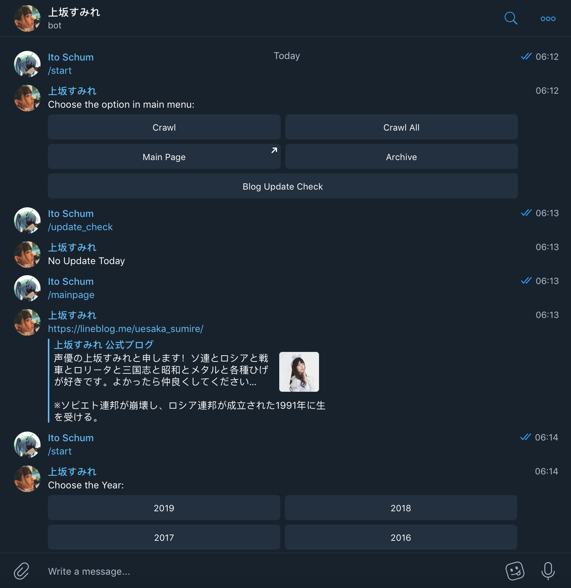

# Sumire Telegram Bot
> **Initial Purpose:** Fetching Uesaka Sumire (上坂すみれ) 's LINE Blog images

## Feature
- Fetching LINE Blog Archive images **(Mainpage & Archive Image ONLY)**

## Requirement
- Telegram

## Usage

### Command Mode:
- `/crawl`: crawl the images of the latest article only
- `/crawl_all`: crawl the images of the latest three articles
- `/mainpage`: get the mainpage URL
- `/archive`: get the specific archive page URL. FORMAT: /archive [YEAR]-[MONTH] e.g. /archive 2018-12')

### Button Mode
- Type in `/start` always can start the usage 
- Then, same as the command mode.

## Demo

